# Stress detection / Deep learning classification
## he-arc - 3rd project
##### Guillaume Noguera, inf3-dlma

### Stress classification with various machine learning libraries

This school project aims to explore machine learning algorithms through the use of SVM (scikit) and deep learning (keras, tensorflow).
Physiological data samples will be provided by the E4 *empatica* wristband.

# Table of contents
1. [Introduction](#introduction)
2. [Tensorflow / Keras](#tensorflow--keras)
    1. [Hardware side](#hardware-side)
3. [Requirements](#requirements)
4. [Neural networks basics](#neural-networks-basics)
5. [Keras basics](#keras-basics)
6. [Performances Comparison](#performances-comparison)
7. [Data Collection / Workshop](#data-collection)
8. [Data pre-processing](#data-pre-processing)
9. [Individual data](#individual-data)
10. [Input / Ouput format](#input--ouput-format)
11. [Results](#results)
12. [What went wrong](#what-went-wrong)
13. [Possible improvements](#possible-improvements)
14. [Conclusion](#conclusion)


### Introduction

Last year ago, a SVM model has been developed to classify stress levels according to physiological data.
The main aim of the project is to develop a model to see how well the deep learning approach can do in comparison of the svm approach.
In addition of this, the old dataset we have to work with hasn't been properly labelized - a new data collection is thus part of the project.
The old model will obviously use the same dataset to get relevant performance comparisons.


### Tensorflow / Keras

Keras now supports and uses Tensorflow (in addition of Theano) - it can be seen as an higher level library using tf - and will shortly be integrated to it.
It can be used to quickly create complex models with minimal code. Tensorflow is more of a language than a framework, providing its own syntax to develop machine learning models.
While Tensorflow offers a greater degree of freedom, Keras is simpler and more user oriented. Like Scikit-learn, it provides pre-defined models (allowing users to define their own).
A possible approach could be to use those models before diving into Tensorflow (as time could - and *will* - be a possible limitation).
Therefore, our main focus will be on Keras.

[Keras install guide](docs/INSTALL_GUIDE.md)

#### Hardware side

Tensorflow backend can run on CPU or GPU, the latter obviously offering better training performances (roughly 8-10x faster, depending on the GPU). In order to run Keras / Tensorflow with GPU support, both nVIDIA's [CUDA](https://developer.nvidia.com/cuda-toolkit) (Compute Unified Device Architecture) Toolkit v8.0 and [cuDNN](https://developer.nvidia.com/cudnn) v6.0 (NVIDIA's deep neural network library) need to be installed on the host system (CUDA v9.0 and cuDNN v7.0 not being supported yet as of january 2018).

The whole project ran on a modest i7-5700HQ / GTX 980M.

### Requirements

1. SVM approach
  * Familiarization with Support Vector Machines (SVM)
  * Various tests with sci-kit's SVM classifier on provided sample data (iris, digits)
  * First implementation with small E4 datasets
  * Proper implementation with the actual database

2. Deep Learning approach
  * Familiarization with Deep Learning key concepts
  * Familiarization with Tensorflow and Keras libraries
  * Keras / Tensorflow comparison
  * Discussion of the final choice between Keras and Tensorflow

3. Getting data
  * Stress workshop planning
  * Actual data collection
  * Data pre-processing

4. Keras implementation
  * Model creation
  * Training and adjusments
  * (Optional) Tensorflow approach

5. Accuracy comparison
  * Figuring a way to compare algorithms performance (False negative, false positive, etc.)
  * Some visual representations
  * Preparing data for visualization
  * Coordination with the team

6. Documentation
  * Sphinx documentation
  * Ad-hoc LaTeX report

### Neural networks basics

At the core of every neural network is the perceptron, which dates back to the late 1950's. Invented by Frank Rosenblatt, the perceptron was largely inspired by neurobiology as it mimics neurons basic behaviour: a neuron takes an input and then choose to fire or not fire depending on input's value.
The function used to determine if a neuron is activated is called the activation function : it is often a non-linear function (Sigmoid, ArcTan, ReLU), as most real-world problems are non-linear indeed.

Perceptrons can produce one or several ouputs; they can can also be stacked, resulting in a multi-layer perceptron (MLP).
The most basic MLP contains an input layer, an hidden layer and an output layer. As additionnals hidden layers are stacked on the top of each others, our basic MLP transitions into a deep neural network.

### Keras basics

Keras provides us with easy ways to quickly build a model :

```python
model = Sequential()
```

Layers can then be stacked on top of each other this way :

```python
# input arrays of shape (*, 16) and output arrays of shape (*, 32)
model.add(Dense(32, input_shape=(*, 16)))
 # activation function can be specified there
model.add(Dense(10, activation='softmax'))
#and so on
```

Next, the model needs to be compiled. The optimizer, loss function and metrics are provided there.

```python
model.compile(optimizer='rmsprop',
              loss='categorical_crossentropy',
              metrics=['accuracy'])
```
A lot of optimizers are available in Keras, such as stochastic gradient descent, RMSprop (often good for recurrent neural networks), ADAM .. the whole list is available in the [keras documentation.](https://keras.io/optimizers/)

After compilation, the model can be trained & evaluated:

```python
#epochs are the number of passes
model.fit(data, labels, epochs=10, batch_size=32)
score = model.evaluate(x_test, y_test, batch_size=128)
```

### Performances Comparison

[Here's some performances comparison](docs/PERFS.md)

Thoses performances comparison comes from multiple training sessions on the pima diabetes dataset.
Models have been tested with different hidden layers and neurons numbers (from 1x1 to 64x64), with or without Dropout layers, and each time for 5 different optimizers.
Overall, the Rectifier activation function (ReLU) seems to be the best choice for binary classification on this dataset.
As this may vary on different data structure, I think repeating those tests with the proper data can help finding a suitable model.


### Data collection / Workshop

A data collection workshop has been run internally. Volunteers students answered a small survey (general health condition, how energetic they overall feel, stress level, etc.) and took part of the following test (wristband obviously equipped) :

* Listening to a short relaxing music
* Listening to a stressful music
* Watching a short horror trailer
* Playing a ZType game

Subjects were asked if they felt a difference after each activity (more relaxed, a bit more relaxed, a bit more stressed, more stressed, neutral response).
Data was then downloaded from the Empatica cloud as .csv files :

* **TEMP.csv** -  Data from temperature sensor expressed degrees on the Celsius (°C) scale.

* **EDA.csv** - Data from the electrodermal activity sensor expressed as microsiemens.

* **BVP.csv** - Data from photoplethysmograph.

* **HR.csv** - Average heart rate extracted from the BVP signal.The first row is the initial time of the session expressed as unix timestamp in UTC. The second row is the sample rate expressed in Hz.

* **tags.csv** - Event mark times. Each row corresponds to a physical button press on the device; the same time as the status LED is first illuminated. The time is expressed as a unix timestamp in UTC and it is synchronized with initial time of the session indicated in the related data files from the corresponding session.

### Data pre-processing

All E4 wristband sensors deliver different data formats, as the sample rate may vary : the photoplethysmograph sensor (BVP) has a 64Hz sample rate, whereas the electrodermal activity sensor sensor (EDA) only samples at 4Hz.
Thus, we need a function using linear interpolation to even out our arrays  :

```python
def reshape_array_freq(bFreq, freq, ary):
    if bFreq is freq:
        return ary
    else:
        dF = int(freq/bFreq)
        new = np.empty((ary.shape[0]-1) * int(dF))
        for i in range(len(ary)-1):
            delta = (ary[i+1] - ary[i])/dF
            for c in range(int(dF)):
                new[(i*dF)+c] = ary[i] + delta*c
        return new
```

We also need to remove some data at the end of certain data arrays, as they do not have the same length after interpolation (I guess all the sensors don't necessarily stop at the exact same time)

```python

def resize_ary(a1, a2):
    diff = abs(a1.shape[0] - a2.shape[0])
    if a1.shape[0] < a2.shape[0]:
        a2 = a2[:-diff]
    else:
        a1 = a1[:-diff]
    return a1, a2
```

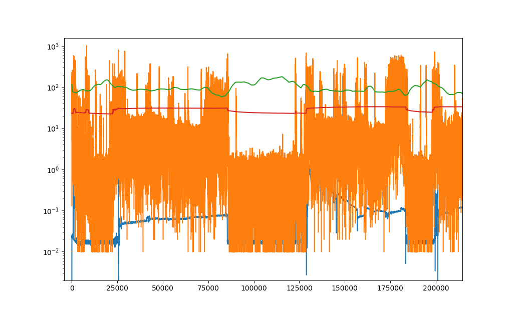


Our data being properly formatted, we then use JSON to store labels from the data collection survey.

```json
{
  "persons" : [
    {
    "id" : 0,
    "file" : "a",
    "time_start" : 25774,
    "time_stop" : 85175,
    "overall_health" : 2,
    "energetic" : 2,
    "overall_stress" : 3,
    "stressed_past_24h" : 3,
    "sleep_quality_past_24h" : 2,
    "sleep_quality_past_month" : 1,
    "tag_relaxed_m" : 29106,
    "tag_stressful_m" : 43013,
    "tag_trailer" : 55472,
    "tag_game" : 74981,
    "reliable" : 1
  }
  {
    "..." : "..."
  }
]
}
```

Later on, those labels will hopefully help our classifier.
My approach was to consider the whole data as a long multidimensional array, resampled to 64Hz. As data collection was done in parallel with two wristbands, I had a few issues putting the time tags at the right place :

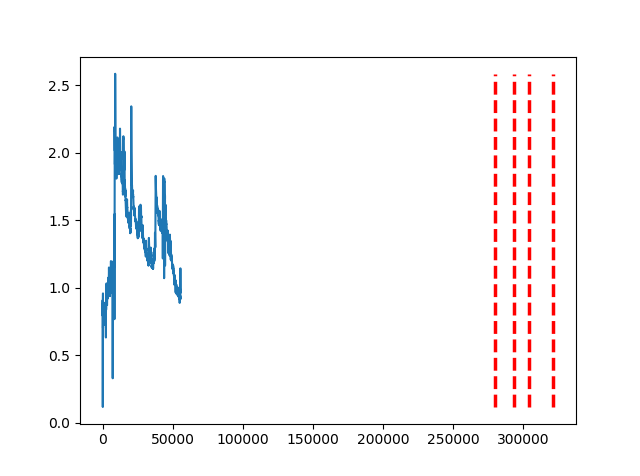

*Oops*

```python
# A bit messy
def concatenate_time(ary_a, ary_b, timestart_a, timestart_b):
    for i in range(ary_a.shape[0]):
        ary_a[i] = ary_a[i] - timestart_a
    for i in range(ary_b.shape[0]):
        ary_b[i] = ary_b[i] - timestart_b

    for i in range(ary_b.shape[0]):
        ary_b[i] = ary_b[i]+ary_a[-1]

    new_ary = np.concatenate((ary_a, ary_b), axis=0)
    for i in range(new_ary.shape[0]):
        new_ary[i] = new_ary[i]*MAXFREQ
    return new_ary
```

A *Person* class is used to store individual data according to the JSON file :

```python
class Person:
    def __init__(self, start, stop, overall_health,
    energetic, overall_stress, stressed_past_24h,
    sleep_quality_past_24h,  sleep_quality_past_month, id):
        self.timestamps = (start, stop)
        self.overall_health = overall_health
        self.energetic = energetic
        self.overall_stress = overall_stress
        self.stressed_past_24h = stressed_past_24h
        self.sleep_quality_past_24h = sleep_quality_past_24h
        self.sleep_quality_past_month = sleep_quality_past_month
        self.id = id
        self.eda = None
        self.hr = None
        self.temp = None
        self.bvp = None
        self.tags = None

    def correct_time(self):
        for i in range(0, len(self.tags)):
            self.tags[i] = self.tags[i] - self.timestamps[0]

    def pprint_eda(self):
        plt.plot(np.linspace(0, self.eda.shape[0], self.eda.shape[0]), self.eda)
        for i in range(0, len(self.tags)):
            plt.plot([self.tags[i],
            self.tags[i]],
            [np.amin(self.eda),
            np.amax(self.eda)],
            color = 'red',
            linewidth = 2.5,
            linestyle = "--",
            label="EDA")
        plt.show()
    # ...

subjects = list()
labels_data = json.load(open('data/labels.json'))
    for persons in labels_data["persons"]:
        subjects.append(Person(persons["time_start"],
        persons["time_stop"],
        persons["overall_health"],
        persons["energetic"],
        persons["overall_stress"],
        persons["stressed_past_24h"],
        persons["sleep_quality_past_24h"],
        persons["sleep_quality_past_month"],
        persons["id"]))
    # ...

for s in subjects:
    s.eda = eda[s.timestamps[0]:s.timestamps[1]]
    s.hr = hr[s.timestamps[0]:s.timestamps[1]]
    s.temp = temp[s.timestamps[0]:s.timestamps[1]]
    s.bvp = bvp[s.timestamps[0]:s.timestamps[1]]
    s.tags = timestamps[np.where(np.logical_and(timestamps>=s.timestamps[0],
      timestamps<=s.timestamps[1]))]
    # ...


''' final data concatenation '''

def load_all_subjects():
	for i in range(len(subjects)):
		if i is 0:
			X = np.array((subjects[i].hr, subjects[i].bvp, subjects[i].eda))
			Y = np.array((subjects[i].binary_output))
		else:
			X = np.concatenate((X, np.array((subjects[i].hr, subjects[i].bvp, subjects[i].eda))), axis=1)
			Y = np.concatenate((Y, np.array((subjects[i].binary_output))), axis=0)
	X = X.T
	return X, Y

```

### Individual data

The red lines indicates the four data collection steps. (In order of appearance, calm music - stressing music - stressing movie excerpt - stressing game).

As scales greatly differs between, it is quite difficult to tell if there is an actual, clear trend going on.
As a rule of thumb, people indicating lesser health condition showed greater responses to stimulus : e.g Subject #5 (Overall health : 1 / Energetic : 1 / Overall stress : 1) showing up to 8 microsiemens - altought it could be due to noise - during the test.


#### Subject #0 :

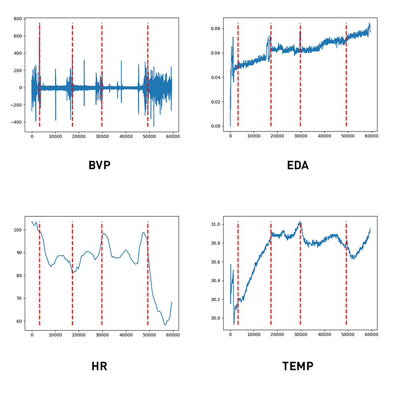

#### Subject #1 :

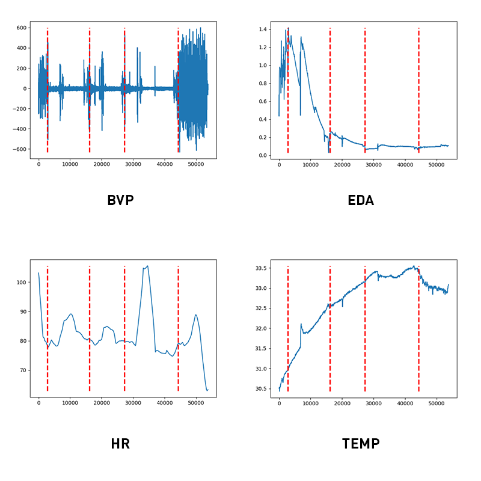

#### Subject #2 :

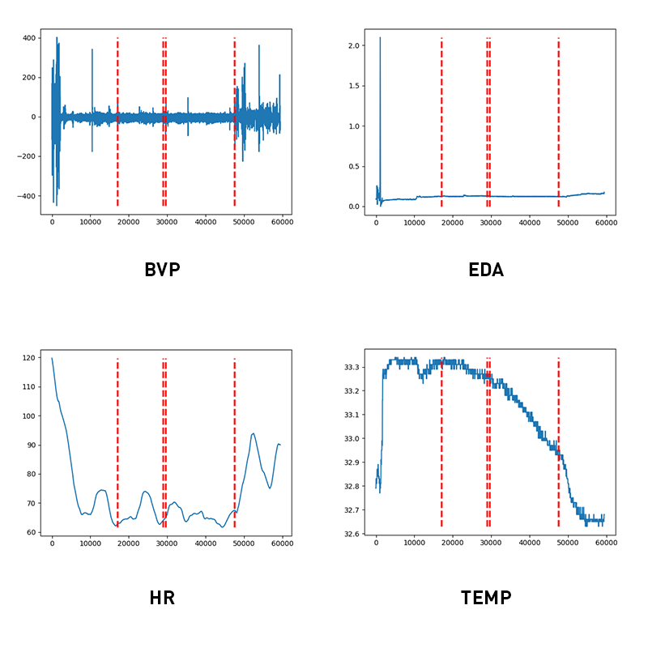

#### Subject #3 :

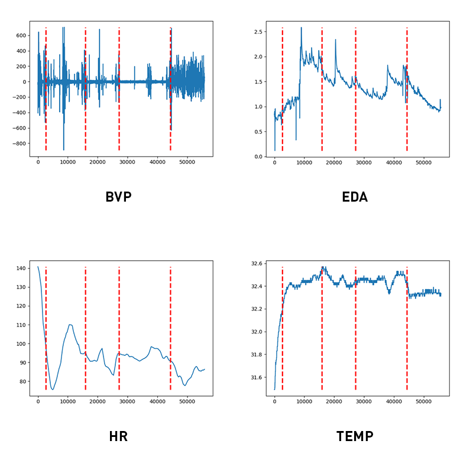

#### Subject #4 :

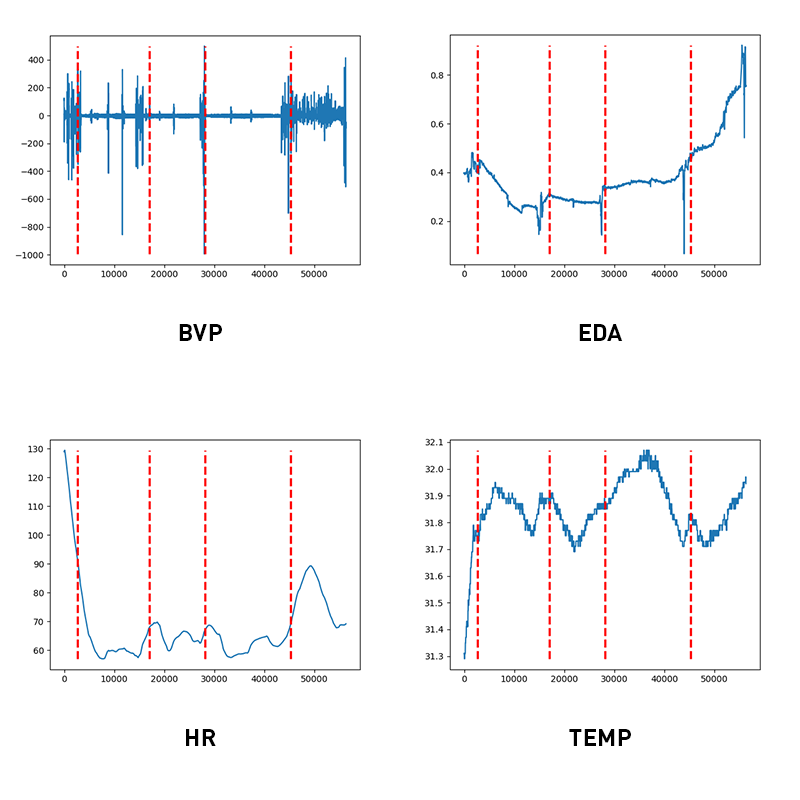

#### Subject #5 :

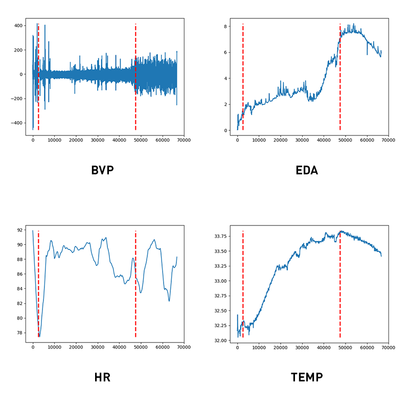

#### Subject #6 :

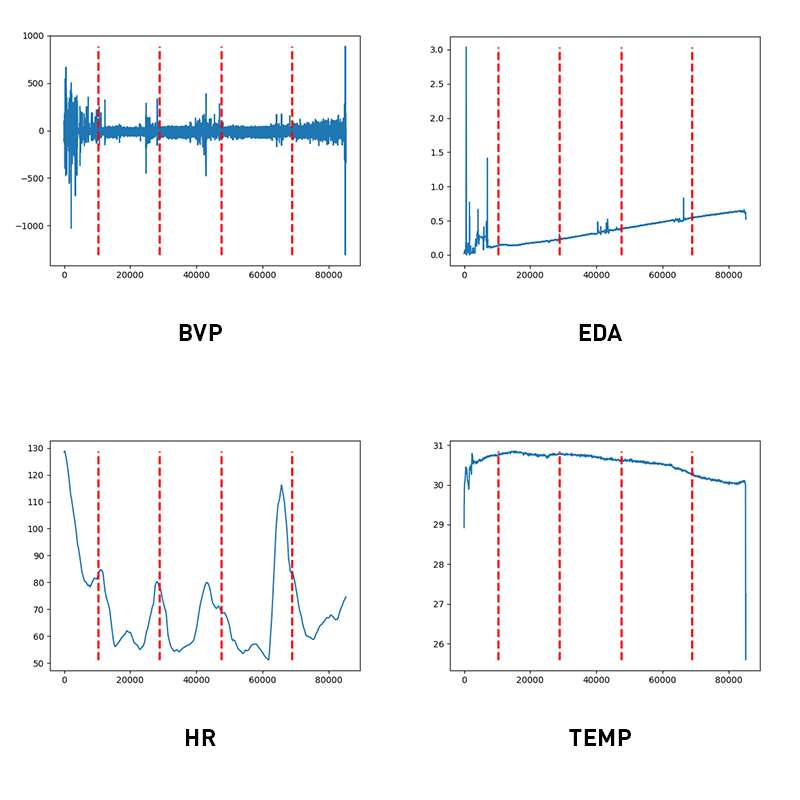

#### Subject #7 :

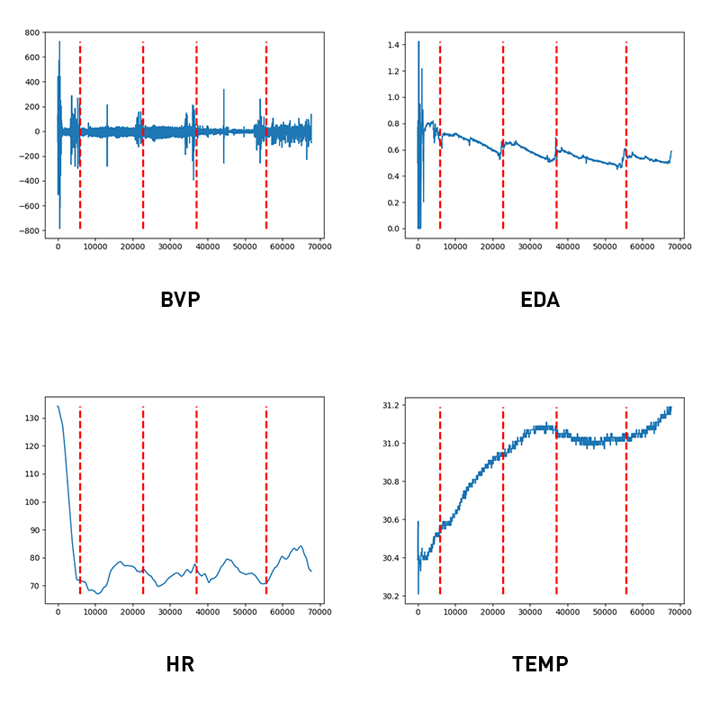

[Individual data](docs/INDIVIDUAL_DATA.md), separated by signal type.

### Input / Ouput format

After data pre-processing, input vector is a numpy array of shape (504134, 8) and looks pretty much like this (id label ):

Index | BVP | EDA | HR | OH_l | OS_l | E_l | other_labels | id |
------------ | ------------ | ------------ | ------------ | ------------ | ------------ | ------------ | ------------ | ------------ |
0 |-2.7811e+02 | 3.20251e-04 | 1.0359e+02 | 4 | 3 | 3 | ... |  0 |
1 |-1761+02 | 1.60125e-04 | 1.0359e+02 | 4 | 3 | 3 | ... | 0 |
2 |-9.86+01 | 0.0000e+00 | 1.0359e+02 | 4 | 3 | 3 | ... | 0 |
... | ... | ... | ... | ... | ... | ... | ...| ... |
58798 | 9.620e+01 | 4.82972e-01 | 1.0315e+02 | 4 | 3 | 3 | ... |  1 |
58799 | 6.490e+01 | 4.66817e-01 | 1.0314e+02 | 4 | 3 | 3 | ... | 1 |
58800 | 2.619e+01 | 4.50662e-01 | 1.0313e+02 | 4 | 3 | 3 | ... | 1 |
... | ... | ... | ... | ... | ... | ... | ...| ... |

Output vector is a simple array of same length filled with corresponding class (0 correspond to a non-stressing activity, 1 to a stressing activity):

Index | Output
------- | ------
... | ...
4652 | 0
4653 | 0
4654 | 1
4655 | 1
... | ...

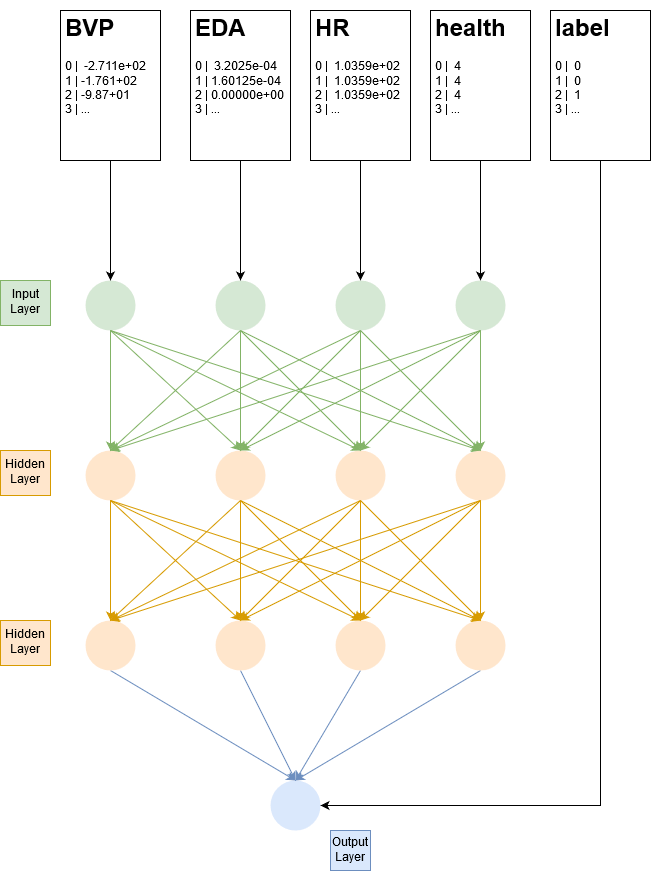

### Results

First results don't include data personalization but still are pretty good :

Binary classifier, statified cross-validation (80% training data, 20% test data, 5 pass, 10 epochs) :
```python
________________________________________________________________
Layer (type)                 Output Shape              Param #
=================================================================
dense_1 (Dense)              (None, 8)                 72
_________________________________________________________________
dense_2 (Dense)              (None, 8)                 72
_________________________________________________________________
dense_3 (Dense)              (None, 8)                 72
_________________________________________________________________
dense_4 (Dense)              (None, 1)                 9
=================================================================
Total params: 225
Trainable params: 225
Non-trainable params: 0

acc: 90.63%
91.62% (+/- 0.83%)
time elapsed :  357.99447441101074  s
```

We can help our classifier adding user-provided data (collected during survey):

```python
def labelize(subjects):
    for i in range(len(subjects)):
        for i in range(len(subjects)):
            shape = subjects[i].bvp.shape[0]
            subjects[i].overall_health = np.full(shape, subjects[i].overall_health)
            subjects[i].overall_stress = np.full(shape, subjects[i].overall_stress)
            subjects[i].energetic = np.full(shape, subjects[i].energetic)
            subjects[i].sleep_quality_past_24h = np.full(shape, subjects[i].sleep_quality_past_24h)
            subjects[i].sleep_quality_past_month = np.full(shape, subjects[i].sleep_quality_past_month)
            subjects[i].stressed_past_24h = np.full(shape, subjects[i].stressed_past_24h)
# ...
X = np.array((subjects[i].hr,
  subjects[i].bvp,
  subjects[i].eda,
  subjects[i].overall_health,
  subjects[i].overall_stress,
  subjects[i].energetic,
  subjects[i].sleep_quality_past_month,
  subjects[i].sleep_quality_past_24h))
#   ...
```

With those informations, our accuray raises up a little bit more :

Binary classifier, statified cross-validation (80% training data, 20% test data, 5 pass, 10 epochs) :
```python
________________________________________________________________
Layer (type)                 Output Shape              Param #
=================================================================
dense_1 (Dense)              (None, 8)                 72
_________________________________________________________________
dense_2 (Dense)              (None, 8)                 72
_________________________________________________________________
dense_3 (Dense)              (None, 8)                 72
_________________________________________________________________
dense_4 (Dense)              (None, 1)                 9
=================================================================
Total params: 225
Trainable params: 225
Non-trainable params: 0

acc: 94.89%
93.18% (+/- 0.92%)
time elapsed :  353.3355987071991  s
```

As epochs are increased, computing time becomes quite long and we hit the 95%+ accuracy.

Binary classifier, statified cross-validation (80% training data, 20% test data, 5 pass, 25 epochs) :
```python
________________________________________________________________
Layer (type)                 Output Shape              Param #
=================================================================
dense_1 (Dense)              (None, 8)                 72
_________________________________________________________________
dense_2 (Dense)              (None, 8)                 72
_________________________________________________________________
dense_3 (Dense)              (None, 8)                 72
_________________________________________________________________
dense_4 (Dense)              (None, 1)                 9
=================================================================
Total params: 225
Trainable params: 225
Non-trainable params: 0

95.35% (+/- 0.79%)
time elapsed :  823.8604867458344  s

```

As the relation seems to be pretty linear (Higher EDA / BVP values -> higher odds of experiencing a stressing situation), a change of model doesn't seems to have this much impact on accuracy.

### What went wrong

* Some errors during data collection (lacking some wristband tags)
* The project took a very long time to see its first "real" results due to my lack of knowledge about NNs
* As any student wanting to see results, bias may occur

### Possible improvements

* Test more models with automatized tests, training time critically increasing as data size grows
* More strict data collection
* Less specific data collection (in order to make the classifier user friendly)
* Ask for more parameters in survey

### Conclusion

As a first approach to machine learning, this project was very insightful. Tasks were varied (lot of readings about neural networks, data collection, model testing, data pre-processing) and I've learned a lot.
Working with Keras also made me curious about Tensorflow : working with pre-determined models is handy but kind of obfuscates the basic workflow of a neural network.

Concerning the stress detection part, our classifier does his job pretty well ! Even with lacking informations over a person health condition, our classifier did manage to recognise a relation between physiological inputs and its equivalent activity.
What should be kept in mind is that it is a very specific network that may very well be biased. The sole fact that subjects were aware of themselves being tested may have increase their stress level.
If we really want to create a \emph{reliable} and \emph{capable} classifier, we should study stress from a medical point of view and ask competent people about determining factors :  A neural network isn't ensured to be able to challenge years of study on a given subject, and knowledge is very valuable when desiging models.

A possible outcome could be to extend the classifier to a live version, communicating with the Empatica wristband at runtime and regularly update its weights. Data personalization could be provided by the client and the service could offer a stress condition tracking.
In the end, I had a lot of fun working on this project and progressed a lot with python libraries. I will definitively tackle on deep learning again.
