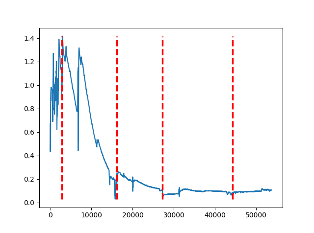
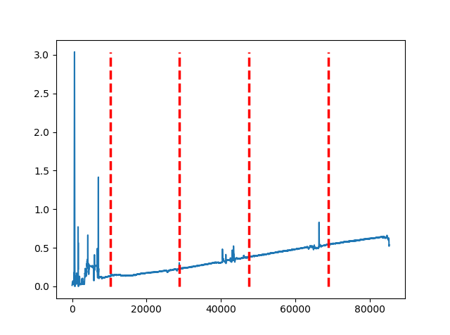
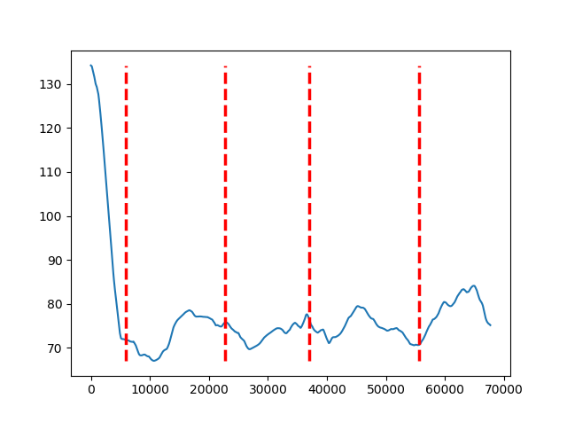

#### EDA :

 Subject 1
 Subject 2
 Subject 3
 Subject 4
 Subject 5
 Subject 6
 Subject 7
 Subject 8

#### BVP :

 Subject 1
 Subject 2
 Subject 3
 Subject 4
 Subject 5
 Subject 6
 Subject 7
 Subject 8

#### HR :

 Subject 1
 Subject 2
 Subject 3
 Subject 4
 Subject 5
 Subject 6
 Subject 7
 Subject 8

#### TEMP :

 Subject 1
 Subject 2
 Subject 3
 Subject 4
 Subject 5
 Subject 6
 Subject 7
 Subject 8
